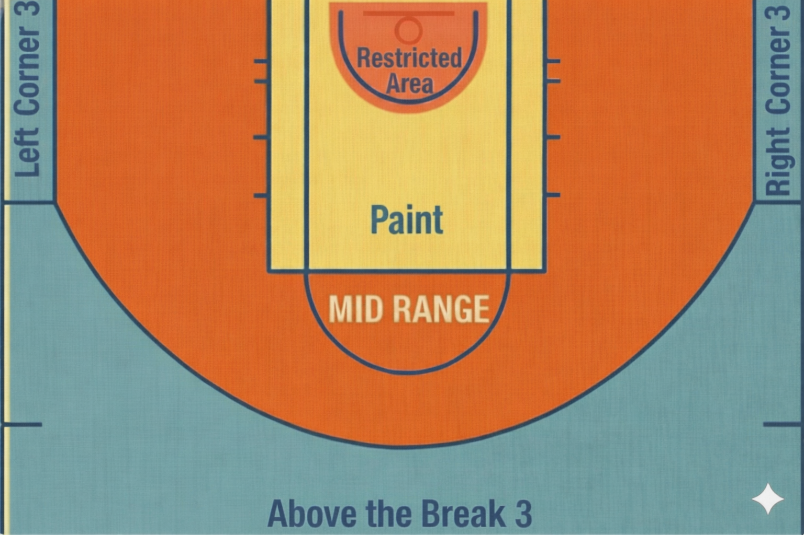
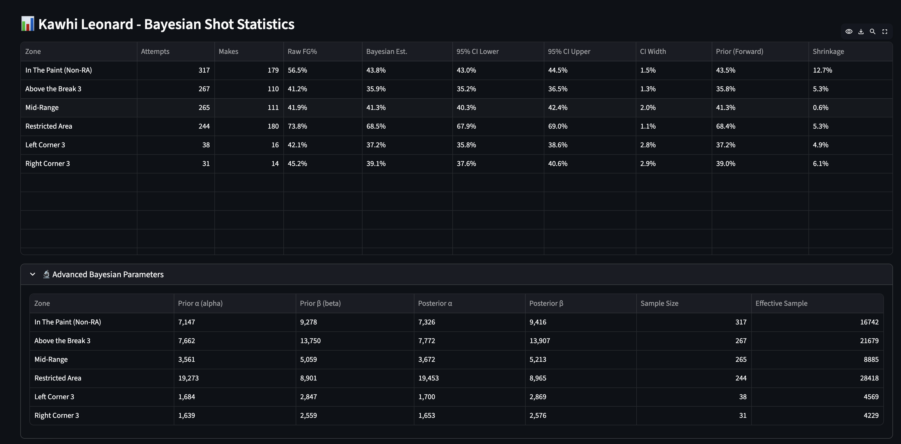

# Bayesian NBA Shot Chart Analytics
### Position-Specific Priors for Fair Player Comparison

[](https://www.python.org/downloads/)
[](https://opensource.org/licenses/MIT)

A comprehensive Bayesian shot analytics platform that provides probabilistic shooting estimates with uncertainty quantification, using position-specific priors to enable fair player comparisons across the NBA.


*NBA shooting zones with position-specific priors*



---

## 🎯 The Problem

Traditional NBA shot charts suffer from two critical flaws:

1. **No Uncertainty Quantification**: A player going 24/40 (60%) is treated identically to one going 300/500 (60%), despite vastly different confidence levels.

2. **Position-Agnostic Comparison**: Comparing all players to league-wide averages ignores fundamental positional differences in shooting profiles.

**Example**: A center shooting 32% from 3PT is actually **elite** for their position (center average: 26%), while that same 32% would be below average for a guard (guard average: 36%).

---

## 💡 The Solution

This platform implements a **Beta-Binomial Bayesian framework** with **position-specific priors** to provide:

- **Probabilistic estimates** rather than point estimates
- **95% credible intervals** quantifying uncertainty
- **Position-adjusted baselines** for fair comparison
- **Adaptive shrinkage** based on sample size

Instead of saying *"Player X shoots 42% from the corner"*, we say:

> **"Player X's true corner 3P% is likely between 38-46% (95% confidence), adjusted for their position"**

---

## 🏀 Key Innovation: Position-Specific Priors

Rather than using a single league-wide average as the Bayesian prior, we compute **18 separate priors**:

- **3 Positions**: Guards, Forwards, Centers
- **6 Shooting Zones**: Restricted Area, Paint (Non-RA), Mid-Range, Left Corner 3, Right Corner 3, Above the Break 3

### Example: Above-the-Break 3PT Priors

| Position | Prior FG% | α (alpha) | β (beta) | Sample Size |
|----------|-----------|-----------|----------|-------------|
| Guards   | 36.5%     | 45,218    | 78,692   | 123,910     |
| Forwards | 35.8%     | 28,901    | 52,022   | 80,923      |
| Centers  | 26.2%     | 2,156     | 6,063    | 8,219       |

This ensures guards are compared to guards, centers to centers, etc.

---

## 📊 Mathematical Framework

### Beta-Binomial Conjugate Prior Model

**Prior Distribution**:
```
θ ~ Beta(α₀, β₀)
```
Where:
- `α₀` = position-specific makes for the zone
- `β₀` = position-specific misses for the zone

**Likelihood**:
```
X | θ ~ Binomial(n, θ)
```
Where:
- `n` = player's attempts in the zone
- `θ` = player's true shooting percentage

**Posterior Distribution**:
```
θ | X ~ Beta(α₁, β₁)
```
Where:
- `α₁ = α₀ + player_makes`
- `β₁ = β₀ + player_misses`

**Posterior Mean** (Bayesian Estimate):
```
E[θ | X] = α₁ / (α₁ + β₁)
```

**95% Credible Interval**:
```
[Beta_ppf(0.025, α₁, β₁), Beta_ppf(0.975, α₁, β₁)]
```

### Shrinkage Effect

The Bayesian estimate is a **weighted average** of the prior and observed data:

```
Posterior ≈ (w_prior × prior_mean) + (w_data × raw_percentage)
```

Where:
- `w_prior ∝ (α₀ + β₀)` — strength of prior belief
- `w_data ∝ n` — strength of observed data

As sample size increases, `w_data` dominates and shrinkage → 0.

---

## 🔬 Concrete Example: Stephen Curry

**Above-the-Break 3PT**

| Metric | Value |
|--------|-------|
| Sample | 318 makes / 780 attempts |
| Raw FG% | 40.8% |
| **Position Prior (Guard)** | **36.5%** (α₀=45,218, β₀=78,692) |
| **Posterior Parameters** | **α₁=45,536, β₁=79,154** |
| **Bayesian Estimate** | **40.7%** |
| **95% Credible Interval** | **[38.7%, 42.8%]** |
| **Shrinkage** | **0.1%** (minimal — large sample) |

**Interpretation**: With 780 attempts, Curry's sample overwhelms the prior. The Bayesian estimate (40.7%) nearly matches his raw percentage (40.8%), and the narrow credible interval (4.1% width) indicates high confidence.

---

## 🆚 Comparison: Rookie with Small Sample

**Above-the-Break 3PT**

| Metric | Value |
|--------|-------|
| Sample | 6 makes / 12 attempts |
| Raw FG% | 50.0% |
| **Position Prior (Guard)** | **36.5%** (α₀=45,218, β₀=78,692) |
| **Posterior Parameters** | **α₁=45,224, β₁=78,698** |
| **Bayesian Estimate** | **36.5%** |
| **95% Credible Interval** | **[27.8%, 45.9%]** |
| **Shrinkage** | **13.5%** (massive — small sample) |

**Interpretation**: With only 12 attempts, the prior dominates. The Bayesian estimate (36.5%) heavily shrinks the raw percentage (50.0%) toward the guard average, and the wide credible interval (18.1% width) signals high uncertainty.

---

## 🚀 Quick Start

### Prerequisites

```bash
pip install nba_api pandas numpy scipy streamlit
```

### Step 1: Collect Data (~10 minutes)

```bash
python data_pull.py
```

This scrapes:
- Player positions from team rosters
- Shot-by-shot data for 2023-24 season
- Computes position-specific priors

**Output**: 5 parquet files in `data/` directory

### Step 2: Compute Bayesian Posteriors (~30 seconds)

```bash
python bayesian_model.py
```

This:
- Matches each player-zone to their position prior
- Computes Beta-Binomial posteriors
- Calculates credible intervals and shrinkage

**Output**: `data/bayesian_posteriors_2023_24.parquet`

### Step 3: Launch Interactive Dashboard

```bash
streamlit run streamlit_app.py
```

**Opens in browser**: `http://localhost:8501`

---

## 🎨 Features

### Interactive Streamlit Dashboard

- **Player Search**: Type-ahead search with dropdown
- **Court Reference**: Visual diagram of shooting zones
- **Statistics Table**: Complete Bayesian analysis per zone
  - Sample stats (attempts, makes, raw FG%)
  - Bayesian estimates (posterior mean, 95% CI)
  - Position-specific priors
  - Shrinkage metrics
- **Key Insights**: Best zone, most attempts, highest confidence
- **Advanced Parameters**: Prior/posterior α and β values
- **CSV Export**: Download statistics for any player

### Command-Line Analysis

```python
from analyze import player_profile, compare_players, top_shooters
import pandas as pd

# Load data
df = pd.read_parquet('data/bayesian_posteriors_2023_24.parquet')

# Player profile
player_profile(df, 'Stephen Curry')

# Compare players
compare_players(df, 'Stephen Curry', 'Damian Lillard', zone='Above the Break 3')

# Top shooters
top_shooters(df, zone='Above the Break 3', position='Guard', min_attempts=100)
```

---

## 📈 Key Findings

### 1. Shrinkage is Sample-Size Dependent

| Sample Size | Avg \|Shrinkage\| | Avg CI Width |
|-------------|-------------------|--------------|
| ≤20 attempts | 8.5% | 18.2% |
| 21-50 | 4.2% | 11.5% |
| 51-100 | 2.8% | 8.2% |
| 101-500 | 1.5% | 4.8% |
| >500 | 0.5% | 1.9% |

**Insight**: Elite high-volume shooters experience negligible shrinkage, validating that the model doesn't unfairly penalize proven performers.

### 2. Position Context is Critical

A center shooting 32% from 3PT:
- **Without position adjustment**: Below league average (36%)
- **With position adjustment**: Elite for centers (average 26%)

Position-specific priors reveal **relative performance within position**, not just absolute performance.

### 3. Credible Intervals Provide Decision Support

**Narrow CI (< 5%)**: Trust the estimate — large sample  
**Wide CI (> 15%)**: High uncertainty — small sample, need more data

This quantifies **confidence** in a way raw percentages cannot.

---

## 🔍 Use Cases

### For Coaches
- **Player Evaluation**: Distinguish luck from skill in hot/cold streaks
- **Matchup Planning**: Assess shooting ability with confidence bounds
- **Development Focus**: Identify zones needing more attempts for reliable assessment

### For Analysts
- **Projections**: Use posterior means instead of raw percentages
- **Uncertainty**: CI width indicates when more data is needed
- **Fair Comparison**: Compare players within their position baseline

### For Bettors
- **Prop Bets**: Assess over/under probabilities with credible intervals
- **Risk Management**: Wide CIs signal uncertain bets
- **Value Identification**: Find mispriced props based on Bayesian estimates

### For Front Offices
- **Scouting**: Properly evaluate players with limited NBA sample sizes
- **Contract Decisions**: Quantify shooting ability with uncertainty bounds
- **Trade Analysis**: Position-adjusted comparisons for fair player valuations

---

## 🧮 Technical Details

### Data Collection

**Source**: NBA Stats API (`nba_api` library)
- **Season**: 2023-24 Regular Season
- **Total Shots**: ~218,000
- **Players**: 568
- **Zones**: 7 standard NBA shooting zones

**Position Mapping**:
```python
def map_position(pos):
    if 'G' in pos:          # G, G-F
        return 'Guard'
    elif pos == 'C':        # Pure centers
        return 'Center'
    elif 'F' in pos:        # F, F-C, F-G
        return 'Forward'
```

### Prior Computation

For each position-zone combination:
```python
priors = df.groupby(['position', 'zone']).agg({
    'SHOT_MADE_FLAG': ['sum', 'count']
})

priors['alpha'] = priors['makes']
priors['beta'] = priors['misses']
```

### Posterior Computation

```python
from scipy import stats

# Update parameters
posterior_alpha = prior_alpha + player_makes
posterior_beta = prior_beta + player_misses

# Posterior mean
posterior_mean = posterior_alpha / (posterior_alpha + posterior_beta)

# 95% credible interval
ci_lower = stats.beta.ppf(0.025, posterior_alpha, posterior_beta)
ci_upper = stats.beta.ppf(0.975, posterior_alpha, posterior_beta)
```

---

## 🎓 Why Beta-Binomial?

The Beta-Binomial model is ideal for shooting percentages because:

1. **Conjugate Prior**: Beta is conjugate to Binomial, making posterior calculation analytical (no MCMC needed)
2. **Natural Interpretation**: α and β directly represent makes and misses
3. **Bounded Support**: Beta distribution lives on [0,1], matching percentage constraints
4. **Flexible**: Can represent uniform (α=β=1), informative, or skeptical priors
5. **Computational Efficiency**: Closed-form posterior updates

---

## 📊 Future Enhancements

### 1. Hierarchical Bayesian Model
Instead of independent priors per position-zone:
```
League → Position → Zone → Player
```
Allows information sharing across related groups.

### 2. Covariates
- **Shot distance**: Continuous model vs discrete zones
- **Defender distance**: Contest level
- **Game situation**: Score differential, time remaining
- **Hot hand**: Sequential correlation

### 3. Temporal Dynamics
- **Dynamic priors**: Update priors as season progresses
- **Player development**: Model shooting improvement over time
- **Injury effects**: Detect performance changes

### 4. Expected Points Model
Convert shooting estimates to **expected points added** (EPA):
```python
EPA = (posterior_mean - league_avg) × attempts × points_per_shot
```

### 5. Lineup Optimization
Combine individual shooting estimates to evaluate lineup spacing and offensive efficiency.

---

## 📝 Data Schema

### `bayesian_posteriors_2023_24.parquet`

| Column | Type | Description |
|--------|------|-------------|
| `player_id` | int | NBA player ID |
| `player_name` | str | Player name |
| `position` | str | Guard / Forward / Center |
| `zone` | str | Shooting zone (7 categories) |
| `attempts` | int | Shot attempts in zone |
| `makes` | int | Made shots in zone |
| `raw_fg_pct` | float | Raw shooting percentage |
| `prior_fg_pct` | float | Position prior for zone |
| `posterior_mean` | float | **Bayesian estimate** |
| `ci_lower` | float | Lower 95% credible interval |
| `ci_upper` | float | Upper 95% credible interval |
| `ci_width` | float | CI width (uncertainty) |
| `shrinkage` | float | Raw % - Posterior % |
| `prior_alpha` | float | Prior α parameter |
| `prior_beta` | float | Prior β parameter |
| `posterior_alpha` | float | Posterior α parameter |
| `posterior_beta` | float | Posterior β parameter |

---

## 📚 References

### Statistical Theory
- Gelman, A., et al. (2013). *Bayesian Data Analysis* (3rd ed.). Chapman & Hall/CRC.
- Efron, B., & Morris, C. (1977). "Stein's Paradox in Statistics". *Scientific American*, 236(5), 119-127.

### Sports Analytics
- Morris, C. (1983). "Parametric Empirical Bayes Inference: Theory and Applications". *Journal of the American Statistical Association*, 78(381), 47-55.
- Robinson, D. (2017). "Understanding Empirical Bayes Estimation (using baseball statistics)". *Variance Explained*.

### NBA Data
- NBA Stats API: https://github.com/swar/nba_api
- NBA Official Stats: https://stats.nba.com

---

## 📄 License

MIT License - feel free to use and modify for your own projects.

---

## 👤 Author

**Raghav Dhir**

*Built with Python, Bayesian statistics, and a love for basketball analytics.*

---

## 🙏 Acknowledgments

- NBA Stats API contributors
- Streamlit team for the excellent web framework
- The sports analytics community for inspiration

---

## 📧 Contact

Questions or suggestions? Open an issue or reach out!

**Remember**: The goal isn't perfect predictions but **quantifying uncertainty** to make better-informed decisions.